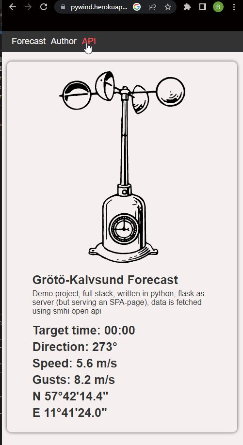

# PyWind

This applications goal is to provide local wind and weather knowledge of specific venues to provide more accurate wind forecasts. It collects forecast data and compares to weather observations. Right now it only uses SMHI Open API.

## Landing page

[https://pywind.herokuapp.com/](https://pywind.herokuapp.com/)



## API response

[https://pywind.herokuapp.com/api](https://pywind.herokuapp.com/api)

```json
[
    {
        "mean_wsp": 5.8,
        "max_wsp": 9.3,
        "direction": 279,
        "latitude": 57.706442,
        "longitude": 11.678861,
        "reference_time": "2022-12-08T22:00:00Z",
        "target_time": "2022-12-08T23:00:00Z",
        "source": "smhi"
    },
    {
        "mean_wsp": 5.6,
        "max_wsp": 8.2,
        "direction": 273,
        "latitude": 57.706442,
        "longitude": 11.678861,
        "reference_time": "2022-12-08T22:00:00Z",
        "target_time": "2022-12-09T00:00:00Z",
        "source": "smhi"
    },
    {
        "mean_wsp": 5.8,
        "max_wsp": 8.4,
        "direction": 272,
        "latitude": 57.706442,
        "longitude": 11.678861,
        "reference_time": "2022-12-08T22:00:00Z",
        "target_time": "2022-12-09T01:00:00Z",
        "source": "smhi"
    },
]
```
